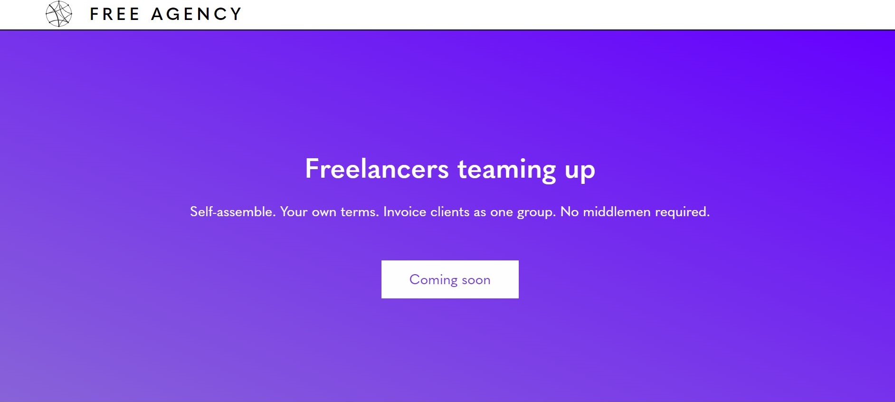

  *Internships.* An opportunity to explore your career options and asses what
you love and what you don't ever want to look at after it's over.

This summer I was lucky enough to meet Allison Kunz, founder of Free Agency and my mentor from Rewriting the Code, who bestowed me the opportunity to be an intern for her company which aligned perfectly with my summer schedule--I got to work remotely. The convenience of getting your work done without having to go to be at set location nine-to-five everyday is a way of life I never thought of before. Communication platforms such as Google Hangout have been an imperative part of my internship. Through this channel, I had weekly updates, conducted my user and usability research, and participated in lessons taught by my mentor for the week. In addition to the internship, Allision guided me to obtain a grant from Maryland Tech Connection which allowed me to purchase courses through DataCamp and further develop skills with Git and Python. Through this internship I had the amazing opportunity to rotate through a number of projects with the help of some very talented mentors.

*From https://freeagency.io/*

## Business + Marketing
###Mentors:
Dianna Berisha & Allison Kunz

####Summary
My first project was to build a competitive landscape analysis. At first I was overwhelmed; I felt like every little detail was important; every color, image and slogan must be noted. I used Google Sheets to document variables for each freeelance marketplace platform such as pain-points, number of users, subscription prices and features. This analysis in addition to networking at technology events allowed the company to narrow down their niche and focus on a product that can be delivered ASAP.

####Takeaways
Research at first seemed daunting. One weakness I noticed was that it was easy to dig yourself in a hole and get too much information on one company that might not be helpful when comparing all the companies on a greater scale. However from the input, recommendations and business articles Dianna provided, I was able to begin filtering through each platform for essential information. In conclusion, I learned that although landscape analyses may be tedious they are essential to a start-up company because it allows one to see what other companies are doing and how we can make do it better.

## User Research + UX Design
###Mentor:
Charles Haitkin

####Summary
This rotation encompassed two aspects of being a UX designer, creation and revision. First, Charles walked me through his first prototype of Free Agency's login process and submitting a proposal. As we went through the prototype he asked questions that provided information on how much the user understands how to handle the site.
#####Account Page

####Takeaways

## ReactJS
###Mentor:
Allison Kunz

####Summary

####Takeaways
