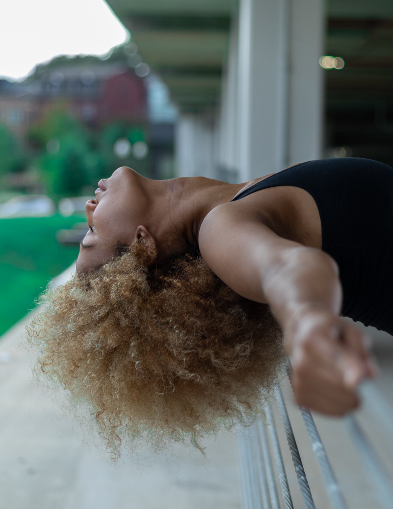

 “I am a feminist, and what that means to me is much the same as the meaning of the fact that I am Black: it means that I must undertake to love myself and to respect myself as though my very life depends upon self-love and self-respect. It means that I must everlastingly seek to cleanse myself of the hatred and the contempt that surrounds and permeates my identity, as a woman, and as a Black human being, in this particular world of ours.”  - June Jordan.

*Photo by @ssimondmv*

##Academic
I'm currently a senior doubling in computer science and communication. I received a certificate in public leadership in 2017. I'm a co-founder of Ladies of Computer Science (LOCS), the first all-women academic club at Maryland.

##Professional
My career goals include getting certified in project management and working either in L.A. or New York. I plan to learn 2D and 3D animation and try some freelance work on the side. I want to make infographics on programming topics for children. My dream job in the future would ultimately be making children's movies, or starting my own company.

##Personal
At UMD, I'm on the women's club volleyball team. I've been playing for 7 years now. I'm also extremely interested in fashion and social justice.
